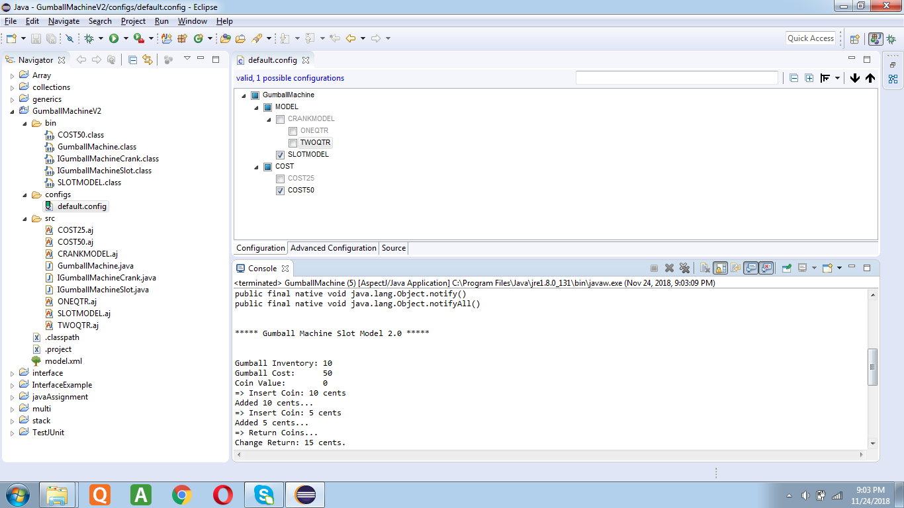
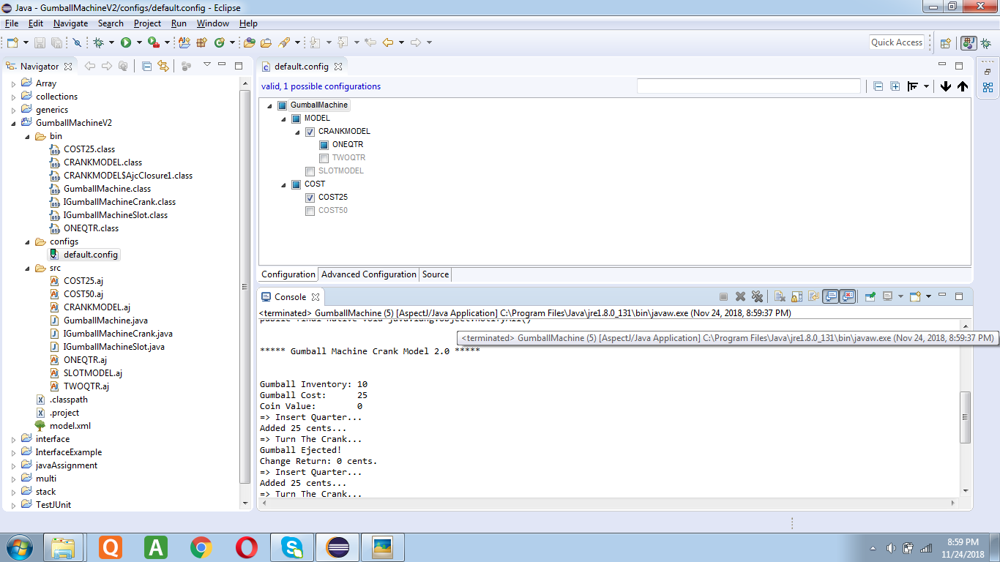

## Lab 10

**Comparison**

In lab 1, I made three objects of GumballMachine class with the model number passed into it. Depending on the model number and the array of input coins passed into the insertQuarter() metod, different variations of the gumball machine were handled.
So changing the configurations would mean huge changes in code as the code is tightly coupled. In FeatureIDE AspectJ, the configuration  of GumballMahcine is in a config file. The configuration can be changed in the config file to set required GumballMachine model. This way, the code is simpler and configurations are easily manageable.

*Screenshots*

 - slot model cost 50 26
 
 - crankmodel one qtr cost 25 24
 
 - crankmodel two qtr cost 50 27
 
